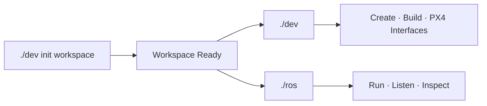
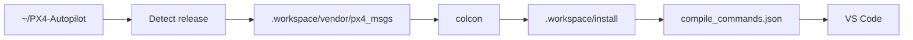

<div align="center">

# DRONE DEV CONSOLE

**ROS 2 Jazzy · PX4 v1.17 · Gazebo Harmonic · C++ · WSL2**


**One initialization. Two commands. Clean repository.**

</div>



## First use

Open the repository root:

```bash
cd ~/ros2
```

Initialize everything with one command:

```bash
./dev init workspace
```

This command is safe to run again. It checks or prepares the development toolchain, ROS dependencies, VS Code extensions, PX4 message interfaces, the first build, and compiler metadata used by IntelliSense.

After initialization, normal development is simply:

```bash
./dev b
```

Whenever you add or edit a C++ source/header, run `./dev b`. CMake/colcon performs an incremental rebuild and refreshes VS Code's real compiler configuration automatically.

---

## Clean workspace layout

Only project-facing files stay visible at repository root:

```text
ros2/
├── app/
├── tools/
├── .vscode/
├── dev
├── ros
└── README.md
```

Generated and external development state is isolated in the hidden `.workspace/` directory:

```text
.workspace/
├── build/
├── install/
├── log/
├── vendor/
├── cache/
└── compile_commands.json
```

VS Code hides `.workspace/` from Explorer and search while still using its generated compiler metadata and PX4 headers.

Older root-level `build/`, `install/`, `log/`, `vendor/`, `.cache/`, and `compile_commands.json` layouts are migrated automatically. External vendor/cache data is preserved; reproducible build artifacts are regenerated instead of being moved with stale absolute paths.

---

## `./dev` — development console

| Command | Purpose |
|---|---|
| `./dev init workspace` | Initialize/migrate the workspace, prepare VS Code/PX4, perform first build |
| `./dev b` | Incremental build + refresh IntelliSense |
| `./dev rb` | Clean rebuild |
| `./dev n sensors/imu` | Create `app/sensors/imu.cpp` |
| `./dev h constants/topics` | Create `app/constants/topics.hpp` |
| `./dev d sensor_msgs` | Add/install a ROS dependency |
| `./dev r core` | Build and run a node |
| `./dev ls` | List detected node executables |
| `./dev px4` | Prepare/check version-matched PX4 ROS message interfaces |
| `./dev check` | Validate project, scripts, node discovery and workspace layout |
| `./dev doctor` | Check WSL, ROS, Gazebo, compiler, VS Code and GPU |
| `./dev fmt` | Format project C/C++ files |
| `./dev clean` | Remove generated build/install/log while preserving vendor state |
| `./dev shell` | Open a workspace-ready ROS shell |

### Normal coding flow

```bash
./dev n state/state
# write code in VS Code
./dev b
./dev r state
```

Headers under `app/` need no manual CMake entry. A `.cpp` containing `int main(...)` becomes a node executable automatically, and newly created files are discovered on the next `./dev b`.

---

## PX4 interface automation

`./dev init workspace`, `./dev b`, `./dev r ...` and `./dev rb` manage the ROS-side PX4 message interface automatically.



The automation detects the local PX4 release, selects the matching `px4_msgs` release line, refuses to overwrite dirty or unexpected vendor repositories, never modifies `~/PX4-Autopilot`, and only rebuilds the interface when necessary.

After that, normal C++ includes are resolved through the same workflow:

```cpp
#include "px4_msgs/msg/vehicle_local_position.hpp"
```

PX4 firmware/SITL itself remains independent and continues to be started from the PX4 repository. `./dev` manages the ROS-side autonomy workspace and PX4 interfaces, not the PX4 firmware build.

---

## `./ros` — runtime console

### Topics

| Command | Purpose |
|---|---|
| `./ros topics` | List topics with message types |
| `./ros listen /drone/status` | Continuously print a topic |
| `./ros once /drone/status` | Read one message |
| `./ros rate /drone/status` | Show message frequency |
| `./ros info /drone/status` | Show publishers/subscribers/QoS |
| `./ros send TOPIC TYPE DATA` | Publish one message |

### Nodes / services / parameters

| Command | Purpose |
|---|---|
| `./ros nodes` | List running nodes |
| `./ros node core` | Inspect a node |
| `./ros run core` | Run an already-built node |
| `./ros services` | List services |
| `./ros call SERVICE TYPE DATA` | Call a service |
| `./ros params core` | List node parameters |
| `./ros get core PARAM` | Read a parameter |
| `./ros set core PARAM VALUE` | Change a parameter |
| `./ros doctor` | Check the ROS runtime environment |

Short aliases:

```text
./ros t        -> topics
./ros l TOPIC  -> listen
./ros o TOPIC  -> once
./ros hz TOPIC -> rate
./ros n        -> nodes
./ros r NODE   -> run
./ros s        -> services
```

---

## VS Code

`Ctrl + Shift + B` runs:

```bash
./dev b
```

The C++ extension reads `.workspace/compile_commands.json`, so project, ROS, and generated PX4 include paths come from the real build configuration instead of hand-maintained guesses.
