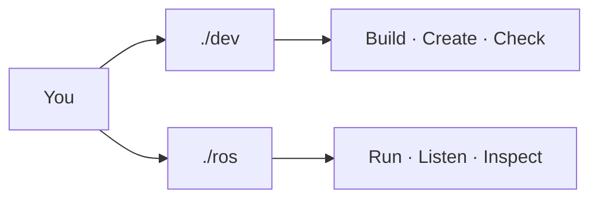

<div align="center">

# DRONE DEV CONSOLE

**ROS 2 Jazzy · Gazebo Harmonic · C++ · WSL2**


**Two commands. One workflow.**

</div>



## Quick start

Always run the automation from the repository root:

```bash
cd ~/ros2
```

One-time setup:

```bash
./dev setup
```

Daily flow:

```bash
./dev b
./ros run core
./ros listen /drone/status
```

You do **not** need to manually run `source /opt/ros/jazzy/setup.bash` or `source install/setup.bash` when using `./dev` or `./ros`.

---

## `./dev` — development console

Use `./dev` when you are changing code, creating files, managing dependencies, or building.

| Command | What it does |
|---|---|
| `./dev b` | Incremental build + refresh VS Code IntelliSense |
| `./dev rb` | Clean rebuild |
| `./dev n sensors/imu` | Create `app/sensors/imu.cpp` |
| `./dev h constants/topics` | Create `app/constants/topics.hpp` |
| `./dev d sensor_msgs` | Add/install a ROS dependency |
| `./dev r core` | Build and run a node |
| `./dev ls` | List detected node executables |
| `./dev check` | Validate project + automation |
| `./dev doctor` | Check WSL, ROS, Gazebo, compiler, VS Code, GPU |
| `./dev fmt` | Format C/C++ files |
| `./dev clean` | Remove generated build files |

### Typical code workflow

```bash
./dev n sensors/imu
# write code in VS Code
./dev b
./dev r imu
```

Header files under `app/` are automatically visible to the build system and VS Code. No manual CMake entry is needed.

---

## `./ros` — ROS runtime console

Use `./ros` when nodes are running and you want to inspect or interact with the ROS graph.

### Topics

| Command | What it does |
|---|---|
| `./ros topics` | List topics with message types |
| `./ros listen /drone/status` | Continuously print topic data |
| `./ros once /drone/status` | Print one message and exit |
| `./ros rate /drone/status` | Show topic frequency |
| `./ros info /drone/status` | Show publishers, subscribers and QoS details |
| `./ros send TOPIC TYPE DATA` | Publish one message |

Example:

```bash
./ros send /demo std_msgs/msg/String '{data: hello}'
```

### Nodes

| Command | What it does |
|---|---|
| `./ros nodes` | List running nodes |
| `./ros node core` | Inspect a running node |
| `./ros run core` | Run an already-built node without rebuilding |

### Services

| Command | What it does |
|---|---|
| `./ros services` | List services with types |
| `./ros call SERVICE TYPE DATA` | Call a service |

### Parameters

| Command | What it does |
|---|---|
| `./ros params core` | List parameters on a node |
| `./ros get core PARAM` | Read a parameter |
| `./ros set core PARAM VALUE` | Change a parameter |

### System

```bash
./ros doctor
./ros help
```

`./ros doctor` verifies that the ROS graph is reachable and shows the active ROS distro, domain ID, and workspace state.

---

## Short aliases

```text
./ros t        -> topics
./ros l TOPIC  -> listen
./ros o TOPIC  -> once
./ros hz TOPIC -> rate
./ros n        -> nodes
./ros r NODE   -> run
./ros s        -> services
./ros h        -> help
```

---

## VS Code

`Ctrl + Shift + B` runs:

```bash
./dev b
```

From **Terminal → Run Task** you can also run build, node execution, project checks, ROS topic listing, and ROS topic listening without typing the commands manually.
