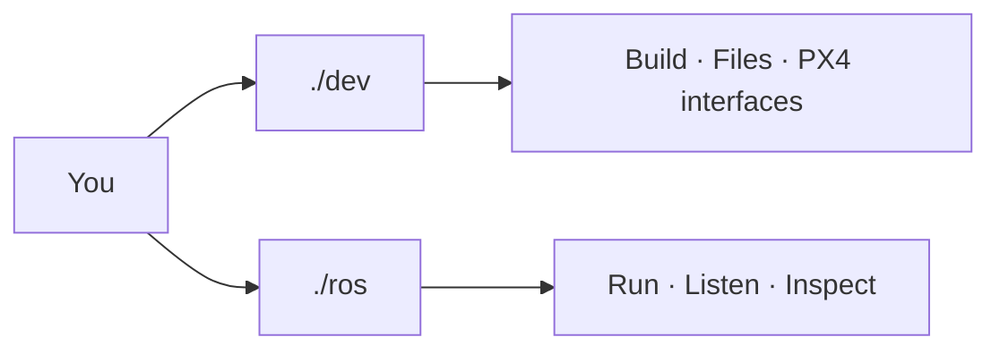
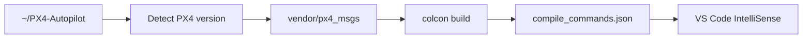

<div align="center">

# DRONE DEV CONSOLE

**ROS 2 Jazzy · PX4 v1.17 · Gazebo Harmonic · C++ · WSL2**


**Two commands. One workflow.**

</div>



## Quick start

Always work from the repository root:

```bash
cd ~/ros2
```

One-time setup:

```bash
./dev setup
```

Daily flow:

```bash
./dev b
./ros run core
./ros listen /drone/status
```

You do **not** need to manually source ROS or the workspace when using `./dev` or `./ros`.

---

## `./dev` — development console

Use `./dev` for code, dependencies, builds, VS Code IntelliSense and PX4 ROS interfaces.

| Command | What it does |
|---|---|
| `./dev b` | Incremental build + refresh VS Code IntelliSense |
| `./dev rb` | Clean rebuild, including required PX4 interfaces |
| `./dev n sensors/imu` | Create `app/sensors/imu.cpp` |
| `./dev h constants/topics` | Create `app/constants/topics.hpp` |
| `./dev d sensor_msgs` | Add/install a ROS dependency |
| `./dev r core` | Build and run a node |
| `./dev ls` | List detected node executables |
| `./dev px4` | Prepare and verify the PX4 ROS interface package |
| `./dev check` | Validate project + automation |
| `./dev doctor` | Check WSL, ROS, Gazebo, compiler, VS Code and GPU |
| `./dev fmt` | Format C/C++ files |
| `./dev clean` | Remove generated build files |

### Typical code workflow

```bash
./dev n state/state
# write code in VS Code
./dev b
./dev r state
```

Headers under `app/` need no manual CMake entry.

---

## Automatic PX4 interface handling

`./dev b`, `./dev r ...` and `./dev rb` automatically prepare the ROS interface package used to access PX4 message types.



The automation:

- detects the local PX4 checkout from `~/PX4-Autopilot` by default;
- matches `px4_msgs` to the detected PX4 release/tag;
- stores the external source only under `vendor/px4_msgs`;
- never edits the PX4 Autopilot checkout;
- never uses `sudo` for PX4 interface setup;
- refuses to overwrite a dirty or unexpected `vendor/px4_msgs` checkout;
- builds the interface only when missing or version-changed;
- exposes generated PX4 C++ headers to VS Code;
- lets normal dependency discovery add `px4_msgs` when your code first includes it.

Manual PX4 interface check:

```bash
./dev px4
```

If PX4 lives somewhere else:

```bash
PX4_AUTOPILOT_DIR=/path/to/PX4-Autopilot ./dev px4
```

After this, C++ includes such as:

```cpp
#include "px4_msgs/msg/vehicle_local_position.hpp"
```

are resolved by the same `./dev b` workflow.

> PX4 firmware/SITL itself remains a separate project and is still started from `~/PX4-Autopilot` with PX4's own build command. `./dev` manages the ROS-side interface, not the PX4 firmware build.

---

## `./ros` — ROS runtime console

Use `./ros` when nodes are running and you want to inspect or interact with the ROS graph.

### Topics

| Command | What it does |
|---|---|
| `./ros topics` | List topics with message types |
| `./ros listen /drone/status` | Continuously print topic data |
| `./ros once /drone/status` | Print one message and exit |
| `./ros rate /drone/status` | Show topic frequency |
| `./ros info /drone/status` | Show publishers, subscribers and QoS details |
| `./ros send TOPIC TYPE DATA` | Publish one message |

Example:

```bash
./ros send /demo std_msgs/msg/String '{data: hello}'
```

### Nodes

| Command | What it does |
|---|---|
| `./ros nodes` | List running nodes |
| `./ros node core` | Inspect a running node |
| `./ros run core` | Run an already-built node without rebuilding |

### Services

| Command | What it does |
|---|---|
| `./ros services` | List services with types |
| `./ros call SERVICE TYPE DATA` | Call a service |

### Parameters

| Command | What it does |
|---|---|
| `./ros params core` | List parameters on a node |
| `./ros get core PARAM` | Read a parameter |
| `./ros set core PARAM VALUE` | Change a parameter |

### System

```bash
./ros doctor
./ros help
```

---

## Short aliases

```text
./ros t        -> topics
./ros l TOPIC  -> listen
./ros o TOPIC  -> once
./ros hz TOPIC -> rate
./ros n        -> nodes
./ros r NODE   -> run
./ros s        -> services
./ros h        -> help
```

---

## VS Code

`Ctrl + Shift + B` runs:

```bash
./dev b
```

After a successful build, `compile_commands.json` is refreshed and VS Code receives the real compiler include paths, including generated PX4 message headers.
